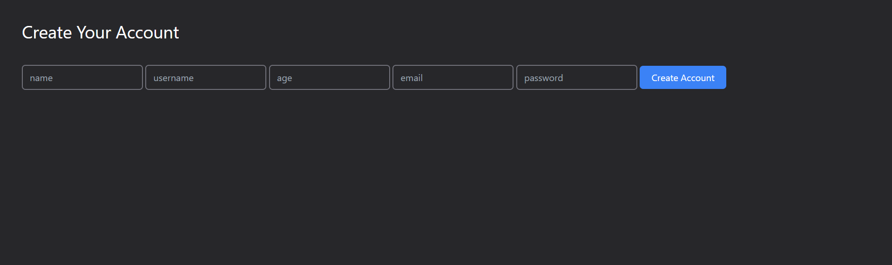
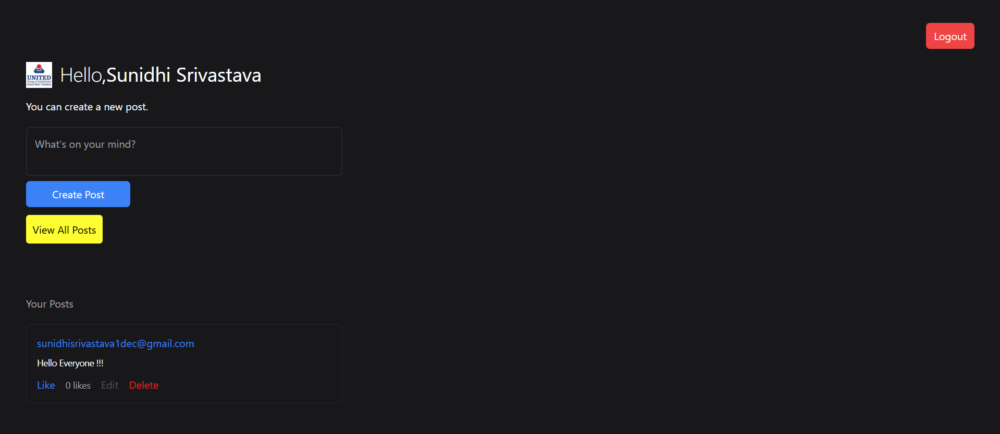
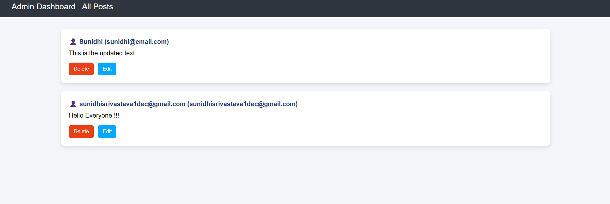

# 📝 Notes App with Auth & Admin Panel

A full-stack Notes Application with secure authentication, role-based authorization (Admin/User), and complete CRUD operations, built using Node.js, Express, MongoDB, and EJS.

---

## 🚀 Features

### 👤 User Features

* Register & Login using JWT Authentication
* Create, Edit, Delete Posts
* Like / Unlike Posts
* Upload Profile Picture

### 👑 Admin Features

* View all user posts
* Delete any post
* Role-based access control

### 📄 Additional Features

* Input Validation using express-validator
* Secure cookies (JWT stored in cookies)
* API Documentation using Swagger UI

---

## 🛠 Tech Stack

* **Backend:** Node.js, Express.js
* **Database:** MongoDB (Mongoose)
* **Frontend:** EJS, CSS
* **Authentication:** JWT + Cookies
* **File Upload:** Multer
* **API Docs:** Swagger

---

## 📁 Project Structure

```
UserPostApp/
│── models/
│── config/
│── views/
│── public/
│── screenshots/
│── app.js
│── package.json
│── .gitignore
```

---

## 🔐 Environment Variables

Create a `.env` file in the root directory:

```
JWT_SECRET=your_secret_key
```

---

## ▶️ Run Locally

```bash
npm install
node app.js
```

Open in browser:

```
http://localhost:3000
```

---

## 📄 API Documentation

Swagger UI available at:

```
http://localhost:3000/api-docs
```

---

## 📸 Screenshots

### 🏠 Home Page



### 🔐 Login Page


### 👤 Profile Dashboard



### 👑 Admin Dashboard



---

## 🚀 Future Improvements

* Pagination & search functionality
* RESTful API improvements
* Deployment (Render / Railway)
* UI enhancements (modern design, dark mode)

---

## 👩‍💻 Author

**Sunidhi Srivastava**

---

## ⭐ Show Your Support

If you like this project, give it a ⭐ on GitHub!
